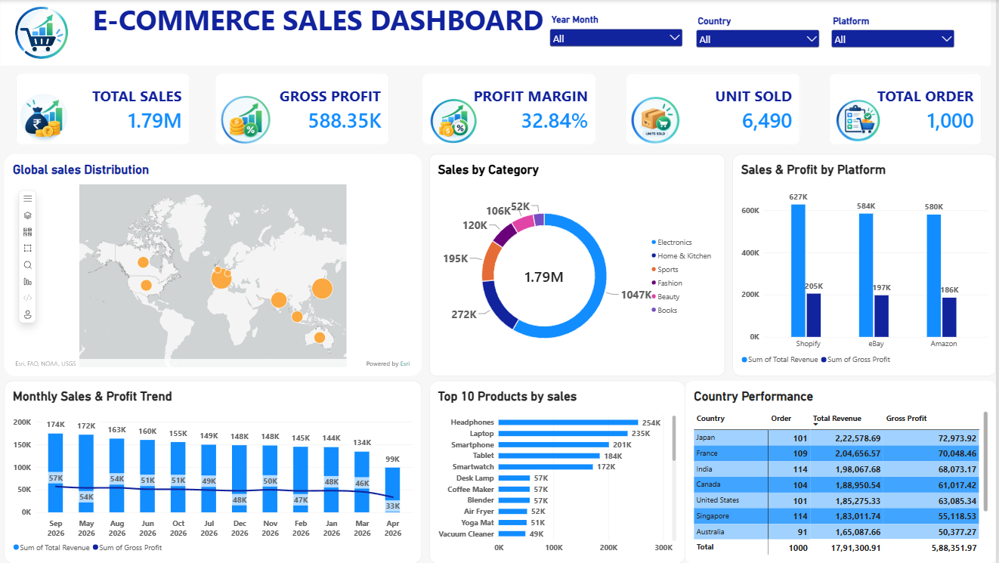

## 📌 Project Overview

This project analyzes e-commerce sales performance using transactional sales data across different products, categories, platforms, and countries.

The objective is to analyze sales, revenue, profitability, product performance, platform performance, and country-wise performance and convert these findings into actionable business insights.

## 🛠️ Tools & Technologies

- Power BI
- Power Query
- DAX

## 📊 Dataset

The dataset contains 1,000 e-commerce sales records with 19 columns covering:

- Order information
- Customer information
- Product details
- Product category
- Sales and pricing information
- Quantity
- Product cost
- Gross profit
- Platform
- Country and region
- Discount
- Payment method
- Shipping mode
- Order status
- Return status
- Customer segment
- Rating
- Sales representative

## 🔄 Project Workflow

### 1. Data Cleaning & Preparation — Power Query

Used Power Query to:

- Import the e-commerce sales dataset
- Promote the first row as column headers
- Set appropriate data types
- Remove duplicate records
- Replace and standardize values where required
- Prepare the data for analysis and visualization

### 2. Data Modeling & DAX

Created a Calendar table using the minimum and maximum order dates from the sales dataset.

Created date fields for:

- Month
- Month Number
- Year
- Year Month

Created calculated fields and measures to support sales and profitability analysis:

- Total Revenue
- Total Cost
- Gross Profit
- Discount Amount
- Total Sales
- Total Orders
- Units Sold
- Gross Profit KPI
- Profit Margin %

### 3. Dashboard — Power BI

Created an interactive Power BI dashboard to visualize:

- Total Sales
- Gross Profit
- Profit Margin
- Units Sold
- Total Orders
- Global Sales Distribution
- Sales by Category
- Sales & Profit by Platform
- Monthly Sales & Profit Trend
- Top 10 Products by Sales
- Country Performance

### 4. Interactive Filters

Added interactive slicers to allow users to analyze the dashboard by:

- Year Month
- Country
- Platform

## 💡 Business Insights

The analysis was used to identify:

- Overall sales and profitability performance
- Sales contribution across product categories
- Sales and profit performance across platforms
- Monthly sales and profit trends
- Top-performing products by sales
- Country-wise sales performance
- Global distribution of sales

## 📈 Dashboard

## 💼 Business Recommendations

Based on the analysis, businesses can:

- Monitor overall sales and profitability performance
- Identify high-performing product categories
- Evaluate sales and profit performance across platforms
- Monitor monthly sales trends
- Focus on high-performing products
- Analyze country-wise performance to identify stronger markets

## 👩‍💻 Skills Demonstrated

- Data Cleaning
- Data Transformation
- Power Query
- DAX
- Data Modeling
- Data Visualization
- Power BI
- Business Analysis
- Sales Analysis
- Profitability Analysis
